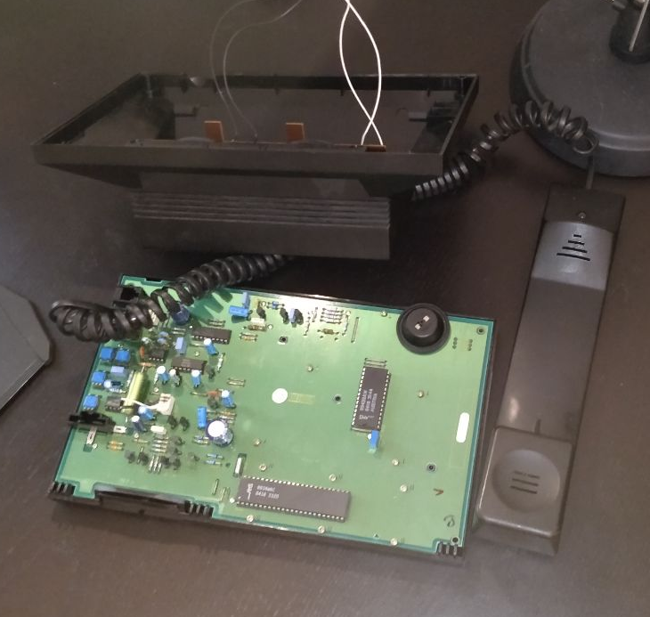
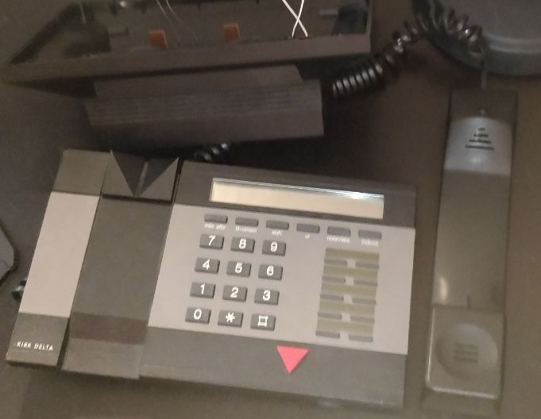

# Control your Denon AVR x2300w with an old phone

Ever felt the need to control your Denon AVR x2300w with an old phone using the phones landline as the controller input? 

# Existing commands

### Overall contols
- '##' - Reset inputs
- '000' - Power off all zones
- '999' - Listen to all changes from the Denon (WARNING: Cannot exit this)

### Main Zone
- '100' - Turn on 
- '101' - Turn off 
- 'XX#' - Set the volume - Example: 42#
- '105' - Mute on/off 
- '110' - Set source - PC (SAT/CBL)
- '111' - Set source - ChromeCast (DVD)
- '112' - Set source - Internet Radio
- '113' - Set source - Lion Bluetooth (CD)

### Zone 2
- '200' - Turn on 
- '201' - Turn off 
- '2#XX#' - Set the volume - Example: 2#42#
- '205' - Mute on/off 
- '210' - Set source - Internet Radio
- '211' - Set source - Lion Bluetooth (CD)

### All Zone Stereo
To play the same audio in Main Zone and Zone 2. 
- '300' - Play the same audio in the Main Zone and Zone 2. 
- '301' - Stop playing the same audio in the Main Zone and Zone 2. 

# Add more commands
1. Create a new command named <YOUR_COMMAND>.py
2. <YOUR_COMMAND>.py have to be a class and implement 2 methods:
	- def CanExecute(self, input):
		Have to return either True or False.
		It should return True when the string 'input' is equal to the wanted input combination you want your command to have. 
		If the string 'input' is not the wanted combination, the method should return False
	
	- def Execute(self, input):
		Implement the actual execution of the command, this can be as complex as you want

3. Add your new command to Start.py in the method GetCommands(...)
4. That is it, you are finished. 

# Requirements
- A Denon AVR x2300w
- An old phone
- Raspberry PI
- A chip to convert the phones signal into a digital readable signal the Raspberry PI can readable
- The Raspberry PI needs to be able to connect with the Denon AVR x2300w on Port 23 (Telnet)

Made by: 
Jens 'JWolf' Larsen

